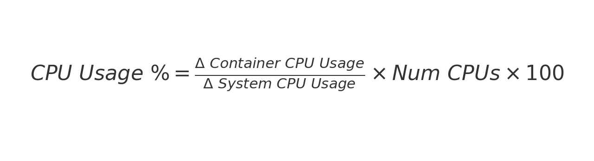
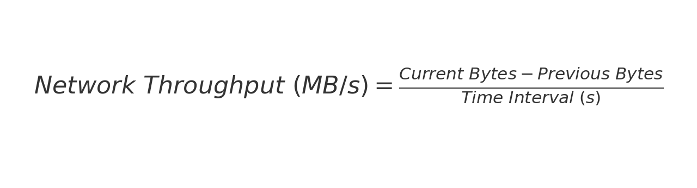

# Performance Comparison

## Overview
This project enables performance testing of functions written in different programming languages, currently supporting **Python** and **Golang**. It helps in comparing resource usage such as CPU, memory, and network throughput.

## Getting Started

### Installation Instructions
1. **Install project dependencies and development tools**:
   ```bash
   make install
   ```
2. **Install pre-commit hooks**:
   ```bash
   make install-hooks
   ```
3. **Run pre-commit hooks manually**:
   ```bash
   make run-hooks
   ```

## Creating Your Own Tests

1. **Template Setup**:
   - If the desired language is **not yet covered**, create a **Dockerfile template** in the `templates/` directory, similar to the existing ones for Python and Golang.
   - Add the necessary frameworks and dependencies for the new language.

2. **Function Implementation**:
   - Place your functions under `functions/<your_language>/logic.<ext>` (e.g., `functions/python/logic.py`).
   - Ensure that your language/framework can **parse test data** properly.

3. **Customizing Test Data**:
   - Modify `request_generator/generator.py` to adjust the data generated for tests.
   - Ensure that data is correctly processed by the **Lua script** and can be converted from JSON to the internal structure in your service.

## Running Benchmarks
To generate backends, Dockerfiles, and benchmark results, and to run the Streamlit app:

```bash
make run
```

## Resource Consumption Metrics
Resource consumption is calculated using community-recommended formulas.

- **CPU Usage**:
  

- **Memory Consumption**:
  

- **Network Throughput**:
  

## Makefile Targets
- `make install` - Install dependencies and development tools.
- `make install-hooks` - Install pre-commit hooks.
- `make run-hooks` - Run all pre-commit hooks manually.
- `make format` - Apply code formatting using **Black** and **isort**.
- `make check` - Check formatting and linting without applying changes.
- `make clean` - Clean up Python cache and artifacts.
- `make run` - Generate required resources and run benchmarks via Streamlit.

## Pre-commit Configuration
To ensure consistent code quality:

- Install **pre-commit** with:
  ```bash
  pip install pre-commit
  ```

- Set up hooks using:
  ```bash
  pre-commit install
  ```

- Manually trigger hooks:
  ```bash
  pre-commit run --all-files
  ```

## Contributing
- Follow the project structure and coding standards.
- Ensure your tests and frameworks can parse and process test data correctly.
- Run all relevant tests and verify the results before submitting a pull request.

## License
This project is licensed under the [MIT License](./LICENSE).

---
